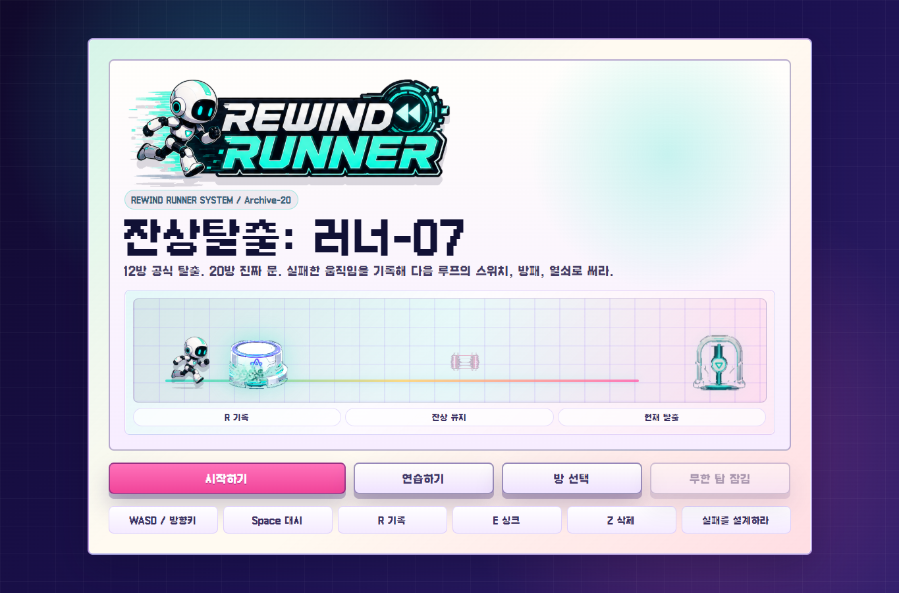
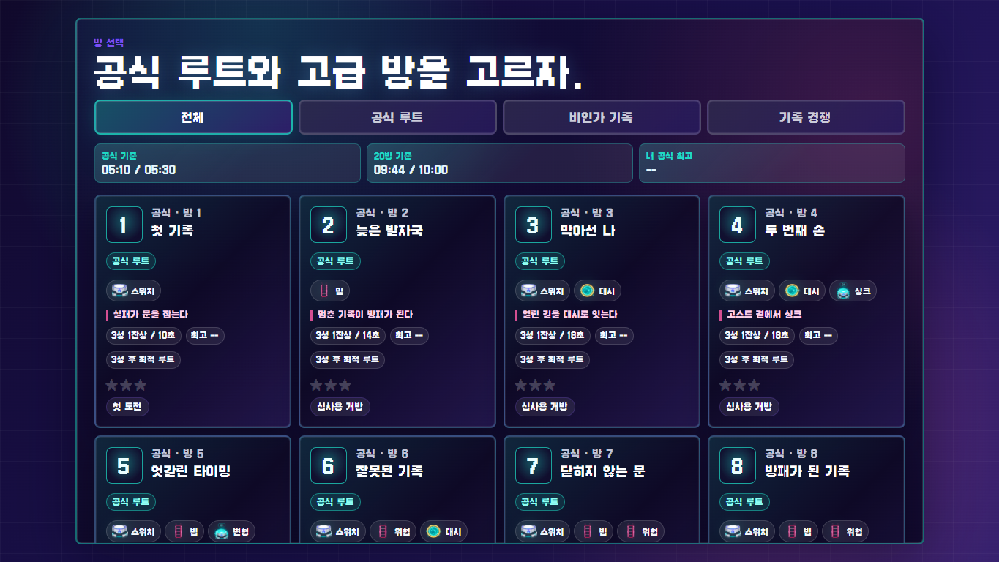
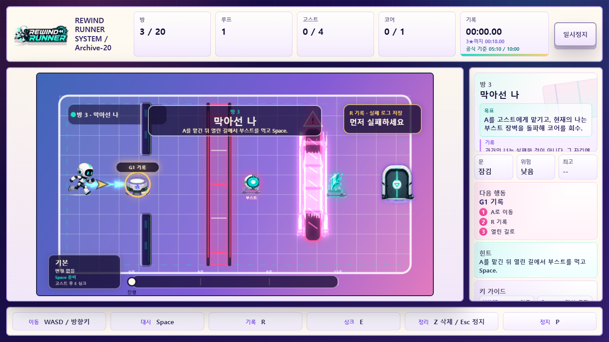
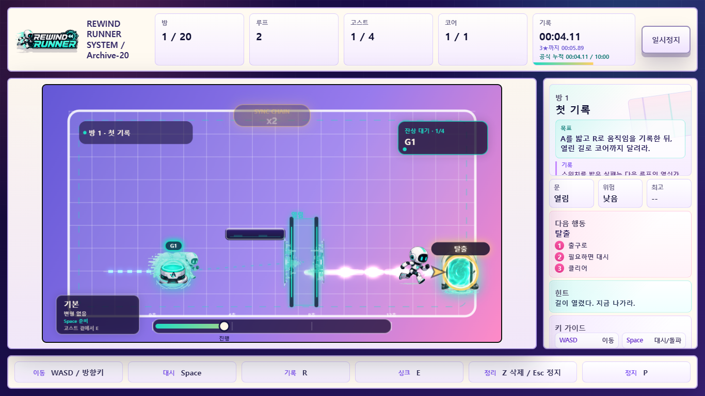

# 잔상탈출: 러너-07

<p align="center">
  
</p>

<p align="center">
  <strong>Afterimage Runner</strong><br />
  A browser puzzle runner where failed movement becomes the next loop's equipment.
</p>

<p align="center">
  <code>REWIND RUNNER SYSTEM / Archive-20</code>
</p>

> 실패한 네가, 다음 너를 구한다.

## Overview

**잔상탈출: 러너-07** is a web-based mini puzzle runner built for a short-session game challenge.

The player controls Runner-07 inside **Archive-20**, a loop facility that tries to delete failed records and preserve only perfect escape data. The twist is simple: the player does not erase failure. The player records it.

Every failed route can return as an afterimage that holds switches, blocks beams, opens gates, anchors timing, or powers a synchronized dash.

This is not a game about flawless execution first.

It is a game about **designing useful failure**.

## Core Pitch

```text
Run.
Fail.
Record.
Return with your failed self.
Escape together.
```

**One-line pitch**

> A puzzle runner where failed movement becomes the next loop's equipment.

**Korean pitch**

> 실패한 움직임을 기록해 다음 루프의 스위치, 방패, 열쇠로 쓰는 웹 퍼즐 러너.

## Screenshots

| Stage Select | Afterimage Hook |
| --- | --- |
|  |  |

| Loop Chorus Result |
| --- |
|  |

## Why It Works

- **Immediate rule clarity**: the first rooms teach one idea at a time: record, replay, cooperate.
- **Fresh puzzle identity**: failure is not a penalty screen, but a tool the player designs.
- **Short-session friendly**: the official 12-room route is designed for a focused under-10-minute judging run.
- **Replay motivation**: rooms track stars, best time, ghost count, personal-best route, and designer-time medals.
- **Story-system match**: the story is not separate from the mechanic. Runner-07 literally escapes with failed selves.

## Game Structure

The game contains **20 rooms**.

- **Rooms 1-12**: official route, designed to communicate the complete game loop quickly.
- **Rooms 13-20**: advanced archive route, introducing deeper mechanics and the true ending.

```text
01 First Record        02 Late Footprint       03 Blocking Myself
04 Second Hand         05 Crossed Timing       06 Wrong Record
07 Unclosing Door      08 Shielded Record      09 Shared Timing
10 Sorted Failure      11 Almost Perfect Loop  12 Official Exit
13 Deletion Deferred   14 Unauthorized Memory  15 Broken Sync
16 Saving Myself       17 Deletion Room        18 Final Sync
19 Record Zero         20 True Door
```

## Core Mechanics

| Mechanic | Purpose |
| --- | --- |
| Afterimage recording | Save a useful failed route with `R` |
| Switch holding | Let a past self keep a gate open |
| Beam blocking | Turn a stopped afterimage into protection |
| Dash gates | Use boost or sync timing to break barriers |
| Size forms | Record small and heavy routes for different switches |
| Phase core | Temporarily pass through archive walls |
| Sync dash | Stand near a ghost, press `E`, then chain a stronger dash |
| PB route | Race a faint personal-best line after clearing |

## Controls

| Action | Key |
| --- | --- |
| Move | `WASD` / Arrow keys |
| Dash | `Space` |
| Record current loop | `R` |
| Sync near afterimage | `E` |
| Delete last afterimage | `Z` |
| Pause | `Esc` / `P` |

## Tech Stack

- Vite
- Vanilla JavaScript
- HTML Canvas
- CSS
- Local storage for progress and personal-best route data

No account, payment, server, advertisement, or external API key is required.

## Project Layout

```text
.
├─ index.html
├─ src/
│  ├─ main.js
│  └─ styles.css
├─ public/
│  └─ assets/
│     ├─ level/
│     ├─ player/
│     ├─ ui/
│     └─ vfx/
├─ docs/
│  ├─ images/
│  ├─ game-plan.md
│  └─ submission-outline.md
├─ scripts/
│  └─ readiness-check.mjs
├─ package.json
└─ package-lock.json
```

Generated folders such as `dist/`, `output/`, `.playwright-cli/`, `test-results/`, and `node_modules/` are intentionally ignored.

## Run Locally

```bash
npm install
npm run dev
```

Then open the local Vite URL in a browser.

## Build

```bash
npm run build
```

## Readiness Check

```bash
npm run verify
```

The readiness check validates:

- 20 playable rooms
- 4 story slides
- required separated PNG assets
- official and full-route timing constraints

## Contest Positioning

**Main hook**

> 완벽한 플레이보다 쓸모 있는 실패가 중요하다.

**Judge-friendly summary**

> 잔상탈출: 러너-07 is a compact web puzzle runner where the player records failed movement and reuses those afterimages as tools. The 12-room official route introduces the full rule set, while the 20-room true route completes the story of Runner-07 recovering every deleted failure.

## Naming

- **Game title**: `잔상탈출: 러너-07`
- **English title**: `Afterimage Runner`
- **In-world system name**: `REWIND RUNNER SYSTEM / Archive-20`
- **Repository**: `Afterimage-Runner`

## License

This repository uses a split license:

- Source code is licensed under the MIT License.
- Game assets, story text, room concepts, level design, logo, branding, screenshots, and other creative content are reserved by the project authors.
- Web typography uses **Galmuri11** by Minseo Lee, distributed under the SIL Open Font License 1.1.

See [LICENSE](./LICENSE) for details.
