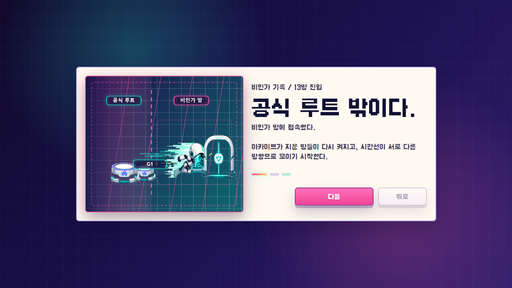

# 잔상탈출: 러너-07

<p align="center">
  <a href="./README.en.md">English</a> · <strong>한국어</strong>
</p>

<p align="center">
  
</p>

<p align="center">
  <strong>실패한 움직임이 다음 루프의 장비가 되는 웹 퍼즐 러너.</strong><br />
  <code>REWIND RUNNER SYSTEM / Archive-20</code>
</p>

> 실패한 네가, 다음 너를 구한다.

## 한 줄 소개

**잔상탈출: 러너-07**은 실패한 플레이를 지우지 않고 기록해, 다음 루프의 스위치, 방패, 열쇠로 사용하는 브라우저 기반 퍼즐 러너입니다.

플레이어는 아카이브 시설에 갇힌 러너-07을 조작합니다. 한 번의 완벽한 조작으로 끝나는 게임이 아니라, 일부러 실패를 남기고 그 실패가 다음 루프에서 어떤 역할을 맡게 할지 설계하는 게임입니다.

```text
달린다.
실패한다.
기록한다.
잔상과 함께 다시 달린다.
문을 연다.
```

## 왜 다른가

- **실패가 리소스가 된다**: 죽거나 리셋되는 움직임이 아니라, 다음 시도에서 실제로 방을 여는 장치가 된다.
- **퍼즐과 액션이 한 화면에서 만난다**: 스위치, 레이저, 대시 벽, 위상막, 패러독스를 실행 타이밍으로 해결한다.
- **짧은 심사 플레이에 맞다**: 12방 공식 루트는 핵심 규칙을 빠르게 보여주고, 20방 진짜 문은 깊이를 증명한다.
- **반복 플레이 이유가 있다**: 별, 최고 기록, 최적 루트, 리플레이, 무한 탑이 기록 경쟁을 만든다.
- **스토리와 규칙이 같은 말을 한다**: 러너-07은 실패를 버리지 않고, 실패한 자신들과 함께 탈출한다.

## 화면

| 메인 메뉴 | 방 선택 |
| --- | --- |
|  |  |

| 인게임 퍼즐 | 13방 스토리 전환 |
| --- | --- |
|  |  |

## 게임 구성

| 구간 | 내용 |
| --- | --- |
| 1-12방 | 공식 루트. 기록, 잔상, 스위치, 레이저, 대시, 싱크, 변형을 순서대로 익힌다. |
| 13-20방 | 비인가 기록. 시간선 꼬임, 위상, 패러독스, 추적 압박이 추가된다. |
| 12방 기준 | 공식 탈출 목표는 누적 5분 30초. |
| 20방 기준 | 진짜 문 목표는 누적 10분. |
| 무한 탑 | 20방 클리어 이후 해금되는 고급 방 변형 챌린지. |

### 방 목록

```text
01 첫 기록              02 늦은 발자국          03 막아선 나
04 두 번째 손           05 엇갈린 타이밍        06 잘못된 기록
07 닫히지 않는 문       08 방패가 된 기록       09 동시에 밟는 마음
10 정리된 실패          11 거의 완벽한 루프     12 공식 탈출

13 삭제 보류            14 비인가 기억          15 망가진 동기화
16 나를 구하는 나       17 삭제실               18 마지막 싱크
19 0번째 기록           20 진짜 문
```

## 핵심 규칙

| 기믹 | 역할 |
| --- | --- |
| 잔상 기록 | `R`로 현재 루프를 저장하고 다음 루프에서 고스트로 재생한다. |
| 스위치 유지 | 과거의 내가 스위치를 밟고 있는 동안 현재의 내가 열린 길을 통과한다. |
| 레이저 차단 | 멈춰 선 잔상이 빔 앞에서 방패가 된다. |
| 대시 벽 | 부스트나 싱크 대시로만 뚫을 수 있는 장벽. |
| 싱크 대시 | 고스트 곁에서 `E`를 눌러 더 강한 돌파를 만든다. |
| 변형 | 소형/중량 상태를 기록해 서로 다른 스위치와 문을 처리한다. |
| 위상 | 위상 코어로 닫힌 막을 잠깐 통과한다. |
| 패러독스 | 13방 이후 현재와 잔상이 겹치면 루프가 붕괴한다. |
| 무한 탑 | 13-20방을 기반으로 층수별 속도, 시간 압박, 함정이 강화된다. |

## 조작

| 행동 | 키 |
| --- | --- |
| 이동 | `WASD` / 방향키 |
| 대시 / 돌파 | `Space` |
| 현재 루프 기록 | `R` |
| 싱크 | `E` |
| 마지막 기록 삭제 | `Z` |
| 일시정지 | `Esc` / `P` |

모바일에서는 가상 방향 패드와 대시, 기록, 싱크, 삭제, 정지 버튼을 제공한다.

## 실행

```bash
npm install
npm run dev
```

Vite가 표시하는 로컬 주소를 브라우저에서 열면 된다.

## 빌드와 검증

```bash
npm run build
npm run verify
```

`npm run verify`는 제출 전 기본 상태를 확인한다.

- 20개 방 데이터
- 7개 슬라이드
- 분리된 PNG 에셋
- 공식/진짜 문 기준 시간

## 기술 구성

| 영역 | 내용 |
| --- | --- |
| 런타임 | Vite, Vanilla JavaScript |
| 렌더링 | HTML Canvas |
| UI | HTML, CSS, 반응형 오버레이 |
| 저장 | LocalStorage 기반 진행도, 최고 기록, 최적 루트 |
| 자산 | 분리된 PNG 스프라이트, UI 슬라이드, VFX |

서버, 로그인, 결제, API 키 없이 브라우저에서 바로 실행된다.

## 프로젝트 구조

```text
.
├─ index.html
├─ src/
│  ├─ main.js          # 게임 상태, 방 데이터, 충돌, 루프, 결과 처리
│  └─ styles.css       # UI, 반응형 레이아웃, 모달, 모바일 조작
├─ public/
│  └─ assets/          # 플레이어, 레벨, UI, VFX PNG 자산
├─ docs/
│  └─ images/          # README용 최신 스크린샷
├─ scripts/
│  └─ readiness-check.mjs
├─ package.json
└─ README.en.md
```

## 제출 포인트

심사자가 30초 안에 이해해야 하는 장면은 단순하다.

1. 현재의 내가 스위치까지 달린다.
2. `R`로 실패 루트를 기록한다.
3. 다음 루프에서 잔상이 스위치를 유지한다.
4. 현재의 나는 열린 길로 탈출한다.

이 순간 게임의 핵심 문장이 성립한다.

> 실패는 끝이 아니라, 다음 나를 위한 장비다.

## 라이선스

이 저장소는 분리 라이선스를 사용한다.

- 소스 코드는 MIT License로 제공된다.
- 게임 자산, 스토리, 방 설계, 로고, 브랜딩, 스크린샷 등 창작 콘텐츠는 프로젝트 저작자에게 권리가 있다.
- 웹 폰트는 Minseo Lee의 **Galmuri11**을 사용하며 SIL Open Font License 1.1을 따른다.

자세한 내용은 [LICENSE](./LICENSE)를 확인해 주세요.
